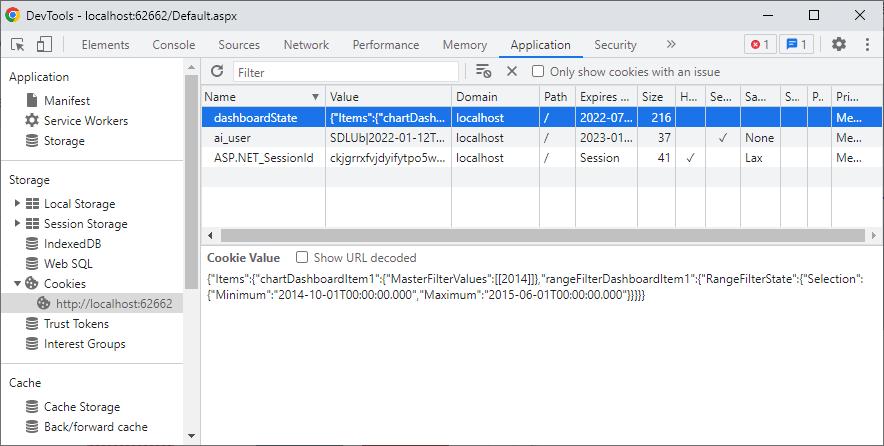

<!-- default badges list -->

<!-- default badges end -->

# Dashboard for Web Forms - How to Save a Dashboard State to Cookies

The example shows how to save the current dashboard state (such as master filter or parameter values) to cookies on the client side and restore this state on the server side.

## Client

The [DashboardControlOptions.onDashboardStateChanged](https://docs.devexpress.com/Dashboard/js-DevExpress.Dashboard.DashboardControlOptions?p=netframework#js_devexpress_dashboard_dashboardcontroloptions_ondashboardstatechanged) event occurs every time the dashboard state changes. In the event handler, the [DashboardControl.getDashboardState](https://docs.devexpress.com/Dashboard/js-DevExpress.Dashboard.DashboardControl?p=netframework#js_devexpress_dashboard_dashboardcontrol_getdashboardstate) method call gets the current dashboard state. The [document.cookie](https://www.w3schools.com/js/js_cookies.asp) property is used to save the dashboard state to cookies every time the state changes.

## Server

In the [ASPxDashboard.SetInitialDashboardState](https://docs.devexpress.com/Dashboard/DevExpress.DashboardWeb.DashboardConfigurator.SetDashboardStateService(DevExpress.DashboardWeb.IDashboardStateService)?p=netframework) event handler, the [HttpRequest.Cookies](https://docs.microsoft.com/en-us/dotnet/api/system.web.httprequest.cookies) property gets a collection of cookies sent by the client. The dashboard state is loaded from the cookies and applied to [e.InitialState](https://docs.devexpress.com/Dashboard/DevExpress.DashboardWeb.SetInitialDashboardStateEventArgs.InitialState) property to set the initial state of the loaded dashboard.

## Files to Review

* [Default.aspx](./CS/WebDashboard_DashboardStateCookies/Default.aspx) (VB: [Default.aspx](./VB/WebDashboard_DashboardStateCookies/Default.aspx))
* [Script.js](./CS/WebDashboard_DashboardStateCookies/Script.js) (VB: [Script.js](./VB/WebDashboard_DashboardStateCookies/Script.js))
* [Default.aspx.cs](./CS/WebDashboard_DashboardStateCookies/Default.aspx.cs) (VB: [Default.aspx.vb](./VB/WebDashboard_DashboardStateCookies/Default.aspx.vb))

## Documentation

- [Manage Dashboard State in ASP.NET Web Forms Applications](https://docs.devexpress.com/Dashboard/118733/web-dashboard/aspnet-web-forms-dashboard-control/manage-dashboard-state)

## More Examples

- [Dashboard for Web Forms - How to specify a default dashboard state in code](https://github.com/DevExpress-Examples/web-forms-dashboard-specify-default-dashboard-state-in-code)
- [Dashboard for ASP.NET Core - How to save a dashboard state to cookies](https://github.com/DevExpress-Examples/asp-net-core-dashboard-save-dashboard-state-to-cookies)
- [Dashboard for MVC - How to save a dashboard state to cookies](https://github.com/DevExpress-Examples/mvc-dashboard-save-dashboard-state-to-cookies)
